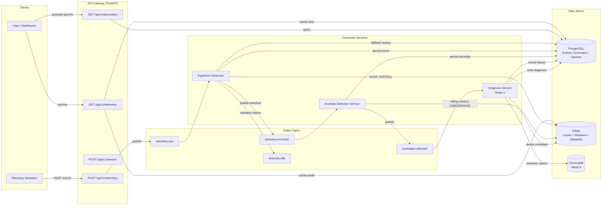

# Telemetry Intelligence Platform

A real-time telemetry ingestion and analysis platform with AI-powered anomaly detection and root-cause diagnosis via a RAG pipeline.

## Overview

This platform collects streaming device telemetry data, detects anomalies using statistical methods (z-score on rolling windows), and generates AI-powered root-cause diagnoses by retrieving semantically similar historical incidents and passing them to an LLM.

The system follows an event-driven microservices architecture with Apache Kafka as the central event backbone, separating the ingestion path (write-heavy, high-throughput) from the query path (read-heavy, low-latency) and the intelligence layer (compute-heavy, async).

## Architecture



## Tech Stack

| Component | Technology |
|-----------|-----------|
| API Framework | FastAPI |
| Event Backbone | Apache Kafka (aiokafka) |
| Primary Store | PostgreSQL (asyncpg) |
| Cache / State | Redis |
| Vector Store | ChromaDB (Week 5) |
| LLM / Embeddings | AWS Bedrock — Titan + Claude (Week 5) |
| Orchestration | Kubernetes (kind) + Terraform |
| Observability | Prometheus + Grafana (Week 4) |
| Testing | pytest + pytest-asyncio |

## Current Status

**Week 1 ✅ — Core Ingestion Pipeline**
- Simulator → API → Kafka → Consumer → PostgreSQL → GET endpoint
- Dead-letter queue for malformed events

**Week 2 ✅ — Redis Integration + Anomaly Detection**
- Device metadata enrichment via Redis (HSET/HGETALL with PostgreSQL fallback)
- Anomaly Detection Service with rolling windows (Redis sorted sets) and z-score
- Cache-aside on GET /api/v1/telemetry (60s TTL)
- GET /api/v1/anomalies and GET /api/v1/anomalies/{id} endpoints
- Simulator with anomaly injection and post-run summary

## Quick Start

### Prerequisites
- Docker with Compose plugin
- Python 3.10+
- uv (Python package manager)

### Setup

```bash
# Clone and enter project
git clone <repo-url>
cd telemetry-intelligence-platform

# Install dependencies
uv sync --dev

# Start infrastructure (PostgreSQL + Kafka + Redis)
docker compose up -d

# Start the API Gateway (terminal 1)
PYTHONPATH=. uvicorn services.api_gateway.app.main:app --reload --port 8000

# Start the Ingestion Consumer (terminal 2)
PYTHONPATH=. python -m services.ingestion_consumer.app.main

# Start the Anomaly Detection Service (terminal 3)
PYTHONPATH=. python -m services.anomaly_detection.app.main

# Run the simulator (terminal 4)
PYTHONPATH=. python -m services.simulator.app.main
```

### Verify

```bash
# Check API health
curl http://localhost:8000/health

# Query ingested telemetry (served from Redis cache on repeated calls)
curl "http://localhost:8000/api/v1/telemetry?limit=5"

# Query detected anomalies
curl http://localhost:8000/api/v1/anomalies

# Check Redis cache keys
docker exec tip-redis redis-cli KEYS "cache:telemetry:*"

# View API documentation
open http://localhost:8000/docs
```

### Run Tests

```bash
# Unit tests (no infrastructure needed)
PYTHONPATH=. uv run pytest -v

# Integration tests (requires Docker services + API + Consumer running)
PYTHONPATH=. uv run pytest tests/integration/ -v
```

## Project Structure

```
telemetry-intelligence-platform/
├── docker-compose.yml          # Infrastructure (PostgreSQL, Kafka, Zookeeper, Redis)
├── pyproject.toml              # Python dependencies
├── .env                        # Environment configuration
├── shared/                     # Shared code (models, utilities)
│ └── models/
├── services/
│ ├── api_gateway/              # FastAPI REST API (cache-aside via Redis)
│ ├── ingestion_consumer/       # Kafka → Redis enrichment → PostgreSQL
│ ├── anomaly_detection/        # Rolling window z-score detection
│ └── simulator/                # Telemetry data generator
├── db/
│ └── init.sql                  # PostgreSQL schema (devices, telemetry_events, anomalies)
├── tests/
│ ├── unit/                     # Pure validation tests
│ └── integration/              # Full pipeline + cache + anomaly tests
└── docs/
└── decisions.md                # Architecture decision log
```

## API Endpoints

| Method | Endpoint | Description |
|--------|----------|-------------|
| POST | `/api/v1/devices` | Register a new device |
| GET | `/api/v1/devices` | List registered devices |
| POST | `/api/v1/telemetry` | Ingest telemetry event (→ Kafka, returns 202) |
| GET | `/api/v1/telemetry` | Query historical telemetry with filters (cached, 60s TTL) |
| GET | `/api/v1/anomalies` | Query detected anomalies (filter by device, severity, time range) |
| GET | `/api/v1/anomalies/{id}` | Retrieve a single anomaly by ID |
| GET | `/health` | Liveness check |

Full interactive API docs available at `/docs` when the API is running.


