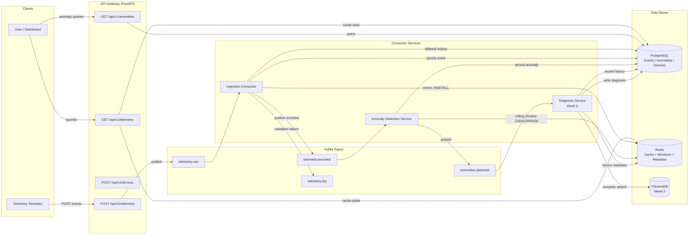
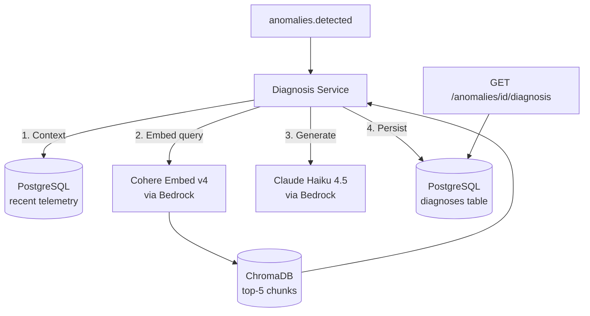

# Telemetry Intelligence Platform

A real-time telemetry ingestion and analysis platform with AI-powered anomaly detection and root-cause diagnosis via a RAG pipeline.

## Overview

This platform collects streaming device telemetry data, detects anomalies using statistical methods (z-score on rolling windows), and generates AI-powered root-cause diagnoses by retrieving semantically similar historical incidents and passing them to an LLM.

The system follows an event-driven microservices architecture with Apache Kafka as the central event backbone, separating the ingestion path (write-heavy, high-throughput) from the query path (read-heavy, low-latency) and the intelligence layer (compute-heavy, async).

## Architecture



## Tech Stack

| Component | Technology |
|-----------|-----------|
| API Framework | FastAPI |
| Event Backbone | Apache Kafka (aiokafka) |
| Primary Store | PostgreSQL (asyncpg) |
| Cache / State | Redis |
| Vector Store | ChromaDB |
| LLM / Embeddings | AWS Bedrock — Cohere Embed + Claude |
| Orchestration | Kubernetes (kind) + Terraform |
| Observability | Prometheus + Grafana |
| Testing | pytest + pytest-asyncio |

## Current Status

**Week 1 ✅ — Core Ingestion Pipeline**
- Simulator → API → Kafka → Consumer → PostgreSQL → GET endpoint
- Dead-letter queue for malformed events

**Week 2 ✅ — Redis Integration + Anomaly Detection**
- Device metadata enrichment via Redis (HSET/HGETALL with PostgreSQL fallback)
- Anomaly Detection Service with rolling windows (Redis sorted sets) and z-score
- Cache-aside on GET /api/v1/telemetry (60s TTL)
- GET /api/v1/anomalies and GET /api/v1/anomalies/{id} endpoints
- Simulator with anomaly injection and post-run summary

**Week 3 ✅ — Security + Hardening**
- JWT authentication (RS256) with token issuance endpoint
- RBAC with three-role hierarchy (viewer < operator < admin)
- Rate limiting via Redis sliding window (1000 req/min ingestion, 100 req/min queries)
- Resilience: cache-aside fails gracefully when Redis is down, 503 on Kafka failure
- Simulator authenticates as operator before sending telemetry

**Week 4 ✅ — Containerization, Orchestration & Observability**
- Prometheus instrumentation on all services (`/metrics` endpoints)
- Health (`/health`) and readiness (`/ready`) probes
- Prometheus scraping all three services (15s interval)
- Grafana with three auto-provisioned dashboards (System Overview, Ingestion Pipeline, Anomaly Detection)
- Multi-stage Dockerfiles for all services (python:3.11-slim + uv, ~76MB each)
- docker-compose.yml runs full stack (apps + Prometheus + Grafana) with one command
- Kubernetes deployment via kind (namespace, ConfigMaps, Secrets, Deployments, Services)
- HPA for API Gateway (CPU target 70%, 1–5 replicas)
- Terraform defining production AWS infrastructure (VPC, EKS, RDS, ElastiCache, MSK, ECR, IAM)

**Week 5 ✅ — RAG Diagnosis Pipeline**
- Knowledge Ingestion: 30 synthetic incident reports chunked, embedded (Cohere Embed v4), and stored in ChromaDB + PostgreSQL
- Diagnosis Service: Kafka consumer on `anomalies.detected` runs three-phase RAG pipeline (context → retrieval → generation)
- AWS Bedrock integration via application inference profiles (Cohere Embed v4 for embeddings, Claude Haiku 4.5 for generation)
- `GET /api/v1/anomalies/{id}/diagnosis` returns structured diagnosis or pending status
- `POST /api/v1/knowledge/ingest` (admin) and `GET /api/v1/knowledge/incidents` (viewer+)
- `PATCH /api/v1/anomalies/{id}/status` for workflow transitions (open → acknowledged → resolved)
- Local embedding fallback (`EMBEDDING_PROVIDER=local`) for development without AWS credentials
- Dockerfile, docker-compose, K8s manifests, Prometheus metrics (`diagnoses_generated_total`, `diagnosis_generation_seconds`)

---

## Quick Start

### Prerequisites
- Docker with Compose plugin
- Python 3.11+
- uv (Python package manager)

### Setup

```bash
# Clone and enter project
git clone <repo-url>
cd telemetry-intelligence-platform

# Install dependencies
uv sync --dev

# Generate RSA Keys (first time only)
mkdir -p keys
openssl genrsa -out keys/private.pem 2048
openssl rsa -in keys/private.pem -pubout -out keys/public.pem

# Start the entire stack (infrastructure + all services)
docker compose up -d

# Verify all containers are healthy
docker compose ps
```

### Verify

```bash
# Check API health
curl http://localhost:8000/health

# Obtain a token
TOKEN=$(curl -s -X POST http://localhost:8000/api/v1/auth/token \
  -H "Content-Type: application/json" \
  -d '{"username": "operator", "password": "operator123"}' | python -c "import sys,json; print(json.load(sys.stdin)['access_token'])")

# Query ingested telemetry
curl -H "Authorization: Bearer $TOKEN" "http://localhost:8000/api/v1/telemetry?limit=5"

# Query detected anomalies
curl -H "Authorization: Bearer $TOKEN" http://localhost:8000/api/v1/anomalies

# Test RBAC (viewer can't POST)
VIEWER_TOKEN=$(curl -s -X POST http://localhost:8000/api/v1/auth/token \
  -H "Content-Type: application/json" \
  -d '{"username": "viewer", "password": "viewer123"}' | python -c "import sys,json; print(json.load(sys.stdin)['access_token'])")

curl -X POST -H "Authorization: Bearer $VIEWER_TOKEN" http://localhost:8000/api/v1/telemetry
# Returns 403 Forbidden

# View API documentation (open in browser)
# Navigate to: http://localhost:8000/docs

# Prometheus targets (all UP)
# Open: http://localhost:9094/targets

# Grafana dashboards (admin/admin)
# Open: http://localhost:3000
```

### Local Development (with hot-reload)

For active development, run infrastructure in Docker but services locally for instant code reloading:

```bash
# Install dependencies
uv sync --dev

# Start infrastructure only (PostgreSQL + Kafka + Redis + ChromaDB)
docker compose up -d postgres zookeeper kafka kafka-init redis chromadb

# Start services individually (each in its own terminal)
PYTHONPATH=. uv run uvicorn services.api_gateway.app.main:app --reload --port 8000
PYTHONPATH=. uv run python -m services.ingestion_consumer.app.main
PYTHONPATH=. uv run python -m services.anomaly_detection.app.main
PYTHONPATH=. uv run python -m services.diagnosis_service.app.main
PYTHONPATH=. uv run python -m services.simulator.app.main
```

### Run Tests

```bash
# Unit tests only (no infrastructure needed)
PYTHONPATH=. uv run pytest -v -m "not integration and not manual"

# Integration tests (requires full stack running: Docker services + API + consumer + detection)
PYTHONPATH=. uv run pytest -v -m "integration and not manual"

# All automated tests
PYTHONPATH=. uv run pytest -v -m "not manual"

# Manual resilience tests (stop Redis/Kafka first)
# docker stop tip-redis tip-kafka
PYTHONPATH=. uv run pytest -v -m "manual"
# docker start tip-redis tip-kafka
```
---

## Kubernetes Deployment (kind)

Deploy the full stack to a local Kubernetes cluster using [kind](https://kind.sigs.k8s.io/).

### Prerequisites

- Docker
- [kind](https://kind.sigs.k8s.io/docs/user/quick-start/#installation)
- [kubectl](https://kubernetes.io/docs/tasks/tools/)

### Create Cluster

```bash
kind create cluster --name tip --config k8s/kind-config.yaml
```

### Build and Load Images

```bash
# Build application images
docker compose build

# Load into kind cluster
kind load docker-image telemetry-intel-platform-api-gateway:latest --name tip
kind load docker-image telemetry-intel-platform-ingestion-consumer:latest --name tip
kind load docker-image telemetry-intel-platform-anomaly-detection:latest --name tip
kind load docker-image telemetry-intel-platform-diagnosis-service:latest --name tip
```

### Deploy (in dependency order)

```bash
# 1. Namespace + configuration
kubectl apply -f k8s/namespace.yaml
kubectl apply -f k8s/configmap.yaml
kubectl apply -f k8s/secret.yaml
kubectl create secret generic aws-credentials \
  --from-literal=AWS_ACCESS_KEY_ID="$(aws configure get aws_access_key_id)" \
  --from-literal=AWS_SECRET_ACCESS_KEY="$(aws configure get aws_secret_access_key)" \
  --from-literal=AWS_SESSION_TOKEN="$(aws configure get aws_session_token)" \
  --namespace=tip \
  --dry-run=client -o yaml | kubectl apply -f -

# 2. JWT keys secret (not committed — generate your own keys first)
kubectl create secret generic jwt-keys \
  --from-file=private.pem=keys/private.pem \
  --from-file=public.pem=keys/public.pem \
  --namespace=tip

# 3. PostgreSQL init script
kubectl apply -f k8s/postgres-init-configmap.yaml

# 4. Infrastructure (postgres, redis, zookeeper, kafka, chromadb)
kubectl apply -f k8s/infrastructure.yaml
kubectl wait --for=condition=Ready pods --all -n tip --timeout=120s

# 5. Create Kafka topics (must wait for Kafka to be healthy)
kubectl apply -f k8s/kafka-init.yaml
kubectl wait --for=condition=Complete job/kafka-init -n tip --timeout=60s

# 6. Application services (depend on topics existing)
kubectl apply -f k8s/applications.yaml
kubectl wait --for=condition=Ready pods -l app=api-gateway -n tip --timeout=60s

# 7. Monitoring (Prometheus + Grafana)
kubectl apply -f k8s/grafana-dashboards-configmap.yaml
kubectl apply -f k8s/monitoring.yaml
```

### Verify

```bash
# All pods running
kubectl get pods -n tip

# API Gateway health check
curl http://localhost:30080/health

# Prometheus targets (all UP)
# Open: http://localhost:30094/targets

# Grafana dashboards (admin/admin)
# Open: http://localhost:30030

# Run simulator against K8s cluster
PYTHONPATH=. API_GATEWAY_URL=http://localhost:30080 uv run python -m services.simulator.app.main
```

### Exposed Ports

| Service | URL | NodePort |
|---------|-----|----------|
| API Gateway | http://localhost:30080 | 30080 |
| Grafana | http://localhost:30030 | 30030 |
| Prometheus | http://localhost:30094 | 30094 |

### HPA (Horizontal Pod Autoscaler)

The API Gateway scales on CPU utilization (target 70%):
```bash
kubectl get hpa -n tip
```

### Tear Down

```bash
kind delete cluster --name tip
```
---

## RAG Diagnosis Pipeline

The platform automatically generates root-cause diagnoses for detected anomalies using a Retrieval-Augmented Generation (RAG) pipeline powered by AWS Bedrock.

### Architecture



### Knowledge Base

The knowledge base contains 30 synthetic incident reports covering failure modes: thermal management, environmental factors, firmware bugs, hardware degradation, network issues, security incidents, and configuration errors.

**Ingesting knowledge (admin only):**

```bash
# Single incident
curl -X POST http://localhost:8000/api/v1/knowledge/ingest \
  -H "Authorization: Bearer $ADMIN_TOKEN" \
  -H "Content-Type: application/json" \
  -d @data/incidents/001_thermal_runaway_edge_gateway.json

# Batch ingest all incidents
PYTHONPATH=. python scripts/ingest_incidents.py
```

**Incident document format:**

```json
{
  "title": "Short descriptive title of the incident",
  "description": "Detailed description of what was observed...",
  "affected_device_types": ["temperature_sensor", "edge_gateway"],
  "root_cause": "Explanation of the root cause...",
  "resolution_steps": ["Step 1", "Step 2", "Step 3"],
  "severity": "low|medium|high|critical",
  "failure_category": "thermal_management|environmental|firmware_bug|...",
  "tags": ["relevant", "search", "tags"]
}
```

### Diagnosis Output
When an anomaly is detected, the Diagnosis Service automatically generates a structured diagnosis (typically within 20-30 seconds):

```json
{
  "root_cause_summary": "2-3 sentence explanation of the most likely root cause",
  "confidence_score": 0.72,
  "supporting_evidence": ["evidence point 1", "evidence point 2"],
  "recommended_actions": ["action 1", "action 2"],
  "retrieved_incident_ids": ["uuid1", "uuid2"]
}
```

### Configuration

| Variable | Default | Description |
|----------|---------|-------------|
| `BEDROCK_MODEL_ID` | — | ARN of the generation model (Claude Haiku 4.5) |
| `BEDROCK_EMBEDDING_MODEL_ID` | — | ARN of the embedding model (Cohere Embed v4) |
| `EMBEDDING_PROVIDER` | `bedrock` | Use `local` for ChromaDB's built-in model (no AWS needed) |
| `CHROMA_HOST` | `localhost` | ChromaDB hostname |
| `CHROMA_PORT` | `8100` | ChromaDB port (host-mapped; internal is 8000) |

### Running Without AWS Credentials

Set `EMBEDDING_PROVIDER=local` in `.env` to use ChromaDB's built-in embedding model (all-MiniLM-L6-v2, 384 dimensions) for knowledge ingestion and retrieval. This removes the AWS dependency for the embedding step only — the diagnosis generation step (Claude Haiku 4.5) still requires AWS Bedrock credentials. Without Bedrock credentials, incidents can be ingested and retrieved semantically, but automated diagnoses will not be generated.

**Note**: You cannot mix embedding providers — if you ingest with `local`, you must query with `local`. Choose one provider per deployment and re-ingest if you switch.

---

## Project Structure

```
telemetry-intelligence-platform/
├── docker-compose.yml          # Full stack (PostgreSQL, Kafka, Redis, ChromaDB, apps, monitoring)
├── pyproject.toml              # Python dependencies
├── .env                        # Environment configuration
├── shared/                     # Shared code (models, utilities)
│ ├── logging_config.py
│ ├── metrics.py
│ └── models/
│ └── models.py
├── services/
│ ├── api_gateway/              # FastAPI REST API (auth, RBAC, rate limiting, cache-aside)
│ ├── ingestion_consumer/       # Kafka → Redis enrichment → PostgreSQL
│ ├── anomaly_detection/        # Rolling window z-score detection
│ ├── diagnosis_service         # RAG pipeline (context → retrieval → generation)
│ └── simulator/                # Telemetry data generator with anomaly injection
├── data/
│ └── incidents/                # 30 synthetic incident reports (JSON) for RAG knowledge base
├── scripts/
│ ├── generate_incidents.py     # Generate synthetic incident files
│ └── ingest_incidents.py       # Batch ingest incidents into knowledge base
├── db/
│ └── init.sql                  # PostgreSQL schema (devices, telemetry_events, anomalies, diagnoses, incidents_knowledge)
├── k8s/                        # Kubernetes manifests (kind)
├── terraform/                  # AWS production infrastructure (EKS, RDS, ElastiCache, MSK, ECR)
├── monitoring/ # Prometheus config + Grafana dashboards
├── tests/
│ ├── unit/                     # Pure validation tests
│ └── integration/              # Full pipeline + RAG loop tests
├──  docs/
│ └── decisions.md                # Architecture decision log
```
---

## API Endpoints

| Method | Endpoint | Role | Description |
|--------|----------|------|-------------|
| POST | `/api/v1/auth/token` | — | Obtain a JWT token |
| POST | `/api/v1/devices` | operator | Register a new device |
| GET | `/api/v1/devices` | viewer | List registered devices |
| POST | `/api/v1/telemetry` | operator | Ingest telemetry event (→ Kafka, returns 202) |
| GET | `/api/v1/telemetry` | viewer | Query historical telemetry with filters (cached, 60s TTL) |
| GET | `/api/v1/anomalies` | viewer | Query detected anomalies (filter by device, severity, time range) |
| GET | `/api/v1/anomalies/{id}` | viewer | Retrieve a single anomaly by ID |
| GET | `/api/v1/anomalies/{id}/diagnosis` | viewer | Retrieve RAG-generated diagnosis (or pending status) |
| PATCH | `/api/v1/anomalies/{id}/status` | operator | Update anomaly status (open, acknowledged, resolved) |
| POST | `/api/v1/knowledge/ingest` | admin | Ingest an incident document into the knowledge base |
| GET | `/api/v1/knowledge/incidents` | viewer | List ingested incident documents with filters |
| GET | `/health` | — | Liveness check |
| GET | `/ready` | — | Readiness check (verifies dependencies) |

Full interactive API docs available at `/docs` when the API is running.

---

## Authentication

The API uses JWT tokens (RS256) for authentication. All endpoints except `/health`, `/docs`, and `/api/v1/auth/token` require a valid token.

### Obtaining a Token

```bash
curl -X POST http://localhost:8000/api/v1/auth/token \
  -H "Content-Type: application/json" \
  -d '{"username": "operator", "password": "operator123"}'
```

### Using a Token

Include the token in the Authorization header:

```bash
curl -H "Authorization: Bearer <token>" http://localhost:8000/api/v1/telemetry
```

### Available Test Accounts

| Username | Password | Role | Access |
|----------|----------|------|--------|
| admin | admin123 | admin | Full access (all endpoints + knowledge ingestion) |
| operator | operator123 | operator | Read all + write telemetry + register devices + update anomaly status |
| viewer | viewer123 | viewer | Read-only (GET endpoints only) |

### Token Lifetime

Tokens expire after 60 minutes (configurable via `JWT_EXPIRY_MINUTES`). There is no refresh token mechanism — request a new token when the current one expires.

### Rate Limits

- Telemetry ingestion (POST): 1000 requests/minute per user
- Query endpoints (GET): 100 requests/minute per user
- Exceeded limits return 429 with a `Retry-After` header

